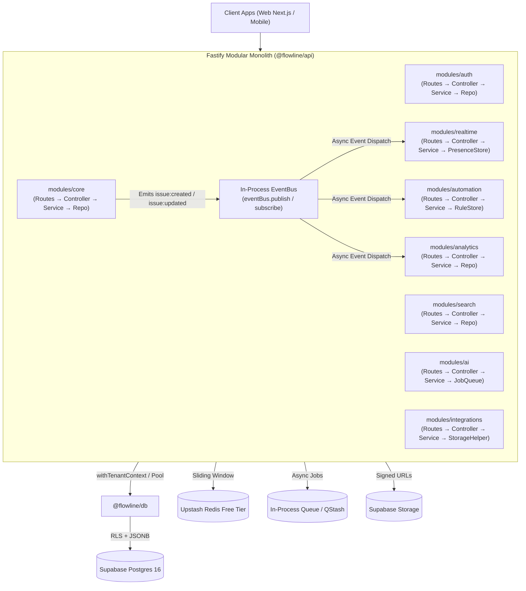

# Flowline Backend Architecture — Free-Tier Modular Monolith (Migration-Ready)

> **Principle:** One deployable application, one free database, zero paid infrastructure ($0/month) — built with strict internal discipline (layered architecture: `routes` → `controller` → `service` → `repository` → `events`/`state`, tenant isolation, domain event contracts) that makes migrating to a service-per-domain architecture later a matter of extraction, not rewrite.
>
> **Related Documents:**
> - [System Overview](file:///d:/INT%20OLD-20260720T064034Z-1-001/INT%20OLD/Playground/uniqueprojmang/docs/architecture/system-overview.md)
> - [Frontend Architecture](file:///d:/INT%20OLD-20260720T064034Z-1-001/INT%20OLD/Playground/uniqueprojmang/docs/architecture/frontend-architecture.md)
> - [ADR 0001: Tenancy Model](file:///d:/INT%20OLD-20260720T064034Z-1-001/INT%20OLD/Playground/uniqueprojmang/docs/adr/0001-tenancy-model.md)
> - [ADR 0002: Modular Monolith Boundaries](file:///d:/INT%20OLD-20260720T064034Z-1-001/INT%20OLD/Playground/uniqueprojmang/docs/adr/0002-modular-monolith-boundary.md)
> - [OpenAPI Specs & API Contracts](file:///d:/INT%20OLD-20260720T064034Z-1-001/INT%20OLD/Playground/uniqueprojmang/docs/api/openapi-specs.md)

---

## 1. Phase 0: Tenancy & Database Model

* **Model:** Pooled multi-tenancy — all tenants share tables, strictly isolated by `tenant_id`.
* **Enforcement:** `tenant_id` column present on every table (including junction, metadata, and audit tables).
* **PostgreSQL Row-Level Security (RLS):** Policies are enforced at the database engine level with `FORCE ROW LEVEL SECURITY` so application bugs cannot leak cross-tenant data even if an application query omits `WHERE tenant_id = ?`:

```sql
-- Enable & Force RLS for all connections (including poolers)
ALTER TABLE issues ENABLE ROW LEVEL SECURITY;
ALTER TABLE issues FORCE ROW LEVEL SECURITY;

-- Enforce tenant isolation via current session setting
CREATE POLICY tenant_isolation_issues ON issues
    AS RESTRICTIVE
    USING (tenant_id = NULLIF(current_setting('app.current_tenant_id', true), '')::UUID)
    WITH CHECK (tenant_id = NULLIF(current_setting('app.current_tenant_id', true), '')::UUID);
```

### 1.1 Modular Schema Architecture (`packages/db/schemas/`)

The database is structured as 11 self-contained, idempotent domain migration modules:

| Order | Module File | Managed Entities & Purpose |
| :--- | :--- | :--- |
| `00` | `00_extensions_and_helpers.sql` | `uuid-ossp`, `pgcrypto`, `pg_trgm`, `set_updated_at()` trigger |
| `01` | `01_auth_and_tenancy.sql` | `tenants`, `users` profile, `tenant_members` & tenant membership RLS |
| `01b` | `01b_rbac_roles_and_permissions.sql` | `permissions`, `tenant_roles`, `tenant_role_permissions`, `project_roles`, `project_role_permissions` & system seeds |
| `02` | `02_projects.sql` | `projects`, `project_members` & project-level RLS |
| `03` | `03_issue_taxonomy.sql` | `issue_types` (hierarchies 0, 1, 2), `issue_statuses`, `priorities` & RLS |
| `04` | `04_sprints.sql` | `sprints` & sprint planning RLS |
| `05` | `05_tickets.sql` | `issues`, auto-key trigger (`generate_issue_key`), search vector trigger (`sync_issue_search_vector`), hierarchy validation trigger (`validate_issue_hierarchy`) |
| `06` | `06_collaboration.sql` | `issue_links`, `labels`, `issue_labels`, `issue_watchers`, `comments`, `attachments` |
| `07` | `07_activity_log.sql` | `activity_log` audit trail |
| `08` | `08_automation.sql` | `automation_rules` JSONB event rules |
| `09` | `09_notifications.sql` | `notifications` inbox |
| `10` | `10_integrations.sql` | `webhooks` & outbound event delivery |

### 1.2 Core Business Triggers & Logic

1. **Auto-Generated Issue Keys (`generate_issue_key`)**:
   * Auto-increments project sequence number and formats human-readable keys (e.g. `ENG-1`, `CUS1-102`).
2. **Strict Issue Hierarchy Validation (`validate_issue_hierarchy`)**:
   * Uses `hierarchy_level`: `0` (Subtask), `1` (Task, Story, Bug), `2` (Epic).
   * Enforces rule: `child_level < parent_level` (Subtasks cannot have children; Tasks cannot nest under Tasks).
3. **Full-Text Search Vector Sync (`sync_issue_search_vector`)**:
   * Automatically computes weighted `tsvector` (`summary`: Weight A, `description`: Weight B) with GIN and Trigram indexes.

---

## 2. Phase 1: Modular Layered Architecture

The backend (`apps/api`) follows a standardized, strongly typed 5-tier layer separation per domain module:

```
apps/api/src/
├── config/
│   ├── env.config.ts            # Strongly-typed environment variables
│   ├── cors.config.ts           # Fastify CORS configuration
│   └── swagger.config.ts        # OpenAPI 3.0 & Swagger UI configuration
│
├── shared/
│   ├── errors/                  # AppError, NotFoundError, ValidationError, ForbiddenError, UnauthorizedError, ConflictError
│   ├── types/                   # TenantContext, PaginationQuery, ApiResponseMeta
│   ├── event-bus.ts             # In-process Domain Event Bus
│   └── logger.ts                # Centralized Pino + Axiom multi-stream structured logger
│
├── plugins/
│   ├── tenancy.plugin.ts        # Tenant extraction & Fastify request decoration
│   ├── authorization.plugin.ts  # RBAC route hooks: requirePermission, requireAnyPermission
│   ├── rate-limit.plugin.ts     # Encapsulated sliding-window tenant rate limiter
│   └── error-handler.plugin.ts  # Global error-to-HTTP status mapping
│
├── health/
│   ├── health.types.ts          # Health response DTOs
│   ├── health.service.ts        # Pure Postgres, Redis, Supabase, and memory checks
│   ├── health.controller.ts     # Health request/reply controller
│   ├── health.routes.ts         # /health and /api/health route bindings
│   └── index.ts
│
├── modules/
│   ├── core/                    # Projects, issues, sprints, comments, decisions
│   │   ├── tickets.sql          # Co-located domain SQL contract
│   │   ├── core.types.ts        # DTOs & typed Fastify route generics
│   │   ├── core.schema.ts       # Fastify JSON validation schemas
│   │   ├── core.repository.ts   # Isolated data access (Postgres / @flowline/db)
│   │   ├── core.events.ts       # Event publishing helpers & payload types
│   │   ├── core.service.ts      # Pure business rules (Zero Fastify imports)
│   │   ├── core.controller.ts   # Typed Fastify HTTP handler
│   │   ├── core.routes.ts       # Clean URL-to-schema-to-controller mapping
│   │   └── index.ts
│   │
│   ├── auth/                    # Users, tenancy context, companies
│   │   ├── auth.sql
│   │   ├── auth.types.ts
│   │   ├── auth.schema.ts
│   │   ├── auth.repository.ts
│   │   ├── auth.service.ts
│   │   ├── auth.controller.ts
│   │   ├── auth.routes.ts
│   │   └── index.ts
│   │
│   ├── permissions/             # Granular RBAC, multi-scope resolution, TTL caching
│   │   ├── permissions.types.ts
│   │   ├── permissions.repository.ts
│   │   ├── permissions.service.ts
│   │   ├── __tests__/
│   │   └── index.ts
│   │
│   ├── automation/              # Sandboxed rule evaluation, event listeners, idempotency
│   │   ├── automation.sql
│   │   ├── automation.types.ts
│   │   ├── automation.schema.ts
│   │   ├── automation.state.ts  # Encapsulated AutomationRuleStore & Idempotency cache
│   │   ├── automation.evaluator.ts # Pure safe expression evaluator
│   │   ├── automation.events.ts # EventBus subscription listener
│   │   ├── automation.service.ts
│   │   ├── automation.controller.ts
│   │   ├── automation.routes.ts
│   │   └── index.ts
│   │
│   ├── realtime/                # In-process events, SSE streams, ephemeral presence
│   │   ├── notifications.sql
│   │   ├── realtime.types.ts
│   │   ├── realtime.schema.ts
│   │   ├── realtime.presence.state.ts # Encapsulated PresenceStore class
│   │   ├── realtime.sse.ts      # SSE protocol streaming & keep-alive manager
│   │   ├── realtime.events.ts   # EventBus listeners piping to realtimeHub
│   │   ├── realtime.service.ts
│   │   ├── realtime.controller.ts
│   │   ├── realtime.routes.ts
│   │   └── index.ts
│   │
│   ├── ai/                      # LLM API callers, async background job queue
│   │   ├── ai.types.ts
│   │   ├── ai.schema.ts
│   │   ├── ai.state.ts          # Encapsulated AIJobQueue
│   │   ├── ai.worker.ts         # Job execution worker
│   │   ├── ai.service.ts
│   │   ├── ai.controller.ts
│   │   ├── ai.routes.ts
│   │   └── index.ts
│   │
│   ├── search/                  # Postgres full-text search (tsvector + pg_trgm)
│   │   ├── search.types.ts
│   │   ├── search.schema.ts
│   │   ├── search.repository.ts
│   │   ├── search.service.ts
│   │   ├── search.controller.ts
│   │   ├── search.routes.ts
│   │   └── index.ts
│   │
│   ├── integrations/            # Inbound webhooks, Supabase storage URLs
│   │   ├── webhooks.sql
│   │   ├── integrations.types.ts
│   │   ├── integrations.schema.ts
│   │   ├── integrations.storage.ts # Storage signed URL generator
│   │   ├── integrations.service.ts
│   │   ├── integrations.controller.ts
│   │   ├── integrations.routes.ts
│   │   └── index.ts
│   │
│   └── analytics/               # Pre-aggregated health metrics & velocity trends
│       ├── analytics.types.ts
│       ├── analytics.schema.ts
│       ├── analytics.repository.ts
│       ├── analytics.service.ts
│       ├── analytics.controller.ts
│       ├── analytics.routes.ts
│       └── index.ts
│
├── app.ts                       # Fastify application builder
└── index.ts                     # Lightweight server startup (~17 lines)
```

### Layer Responsibilities

| Layer | Allowed to do | NOT allowed to do |
| :--- | :--- | :--- |
| `routes.ts` | Register route, bind schema, bind controller handler | Any logic, any DB call, any `as any` |
| `controller.ts` | Read typed `request.params/query/body`, call service, set HTTP status/response shape | Business logic, direct DB access, event publishing |
| `service.ts` | Business rules, orchestration, calls repository + event-bus, throws domain errors | Import anything from `fastify`, touch `request`/`reply` |
| `repository.ts` | DB (`@flowline/db`) queries only, returns domain types | Business logic, HTTP validation, event publishing |
| `events.ts` | Define event payload shapes, subscribe handlers that call into `service.ts` | Route/HTTP concerns |
| `state.ts` | Encapsulate in-memory state, TTL evictions, idempotency caches | Route/HTTP concerns |



---

## 3. Suggested 100% Free-Tier Stack ($0/Month)

| Component | Free Provider | Free Tier Allowance | Purpose |
|---|---|---|---|
| **Database** | **Supabase** | 500 MB Postgres 16 + connection pooling | PostgreSQL with Row-Level Security (RLS) and tsvector search |
| **Compute / API** | **Fastify Monolith / Vercel** | Free tier web service / serverless | Single deployable backend monolith |
| **API Documentation** | **Swagger UI / OpenAPI 3.0** | Built-in via `@fastify/swagger` | Hosted at `/docs` with interactive JWT testing |
| **Cache & Rate Limit** | **Upstash Redis** | 10,000 commands/day via REST | Multi-tenant sliding window rate limiter |
| **Storage** | **Supabase Storage** | 1 GB storage + RLS access control | Attachment uploads via signed URLs |
| **Observability & Logs** | **Axiom Free Tier** | 0.5 GB/day ingest + 30-day retention | Centralized JSON log query engine, audit trails, and live telemetry |
| **Async Jobs** | **In-Process Queue / Upstash QStash** | Free tier | Asynchronous AI jobs and automation execution |

---

## 4. Migration Readiness Checklist

Verify these 5 criteria before extracting any module into a standalone v2 microservice:

- [x] **Clean Boundary:** No code outside the module imports its internal DB models directly (enforced via `index.ts` public exports).
- [x] **Explicit Interface:** All cross-module data requirements go through an explicit `service` function call or domain event, not a shared table join.
- [x] **Documented Domain Events:** Domain events have documented payload schemas (`.events.ts` and `@flowline/types`) and versioning contracts.
- [x] **Decoupled State:** In-memory state structures are encapsulated in class-based `.state.ts` managers with explicit lifecycle APIs.
- [ ] **Concrete Reason for Extraction:** Clear evidence of scaling mismatch, security isolation, or specialized technology requirements (e.g. dedicated AI GPU cluster or Elasticsearch).
