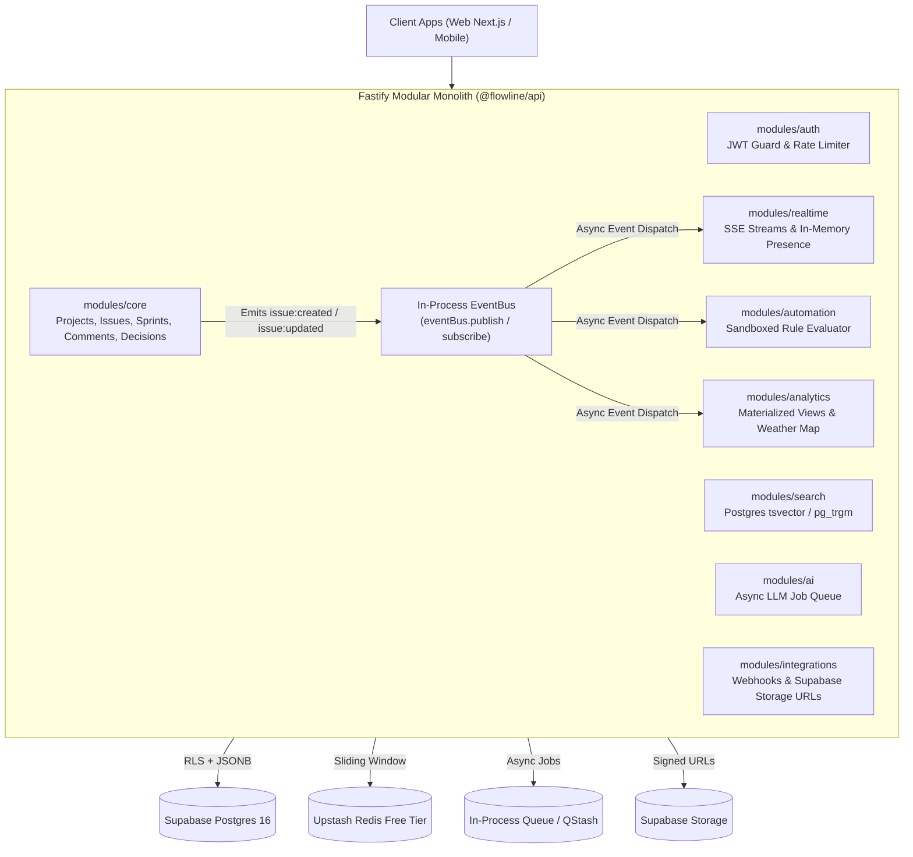

# Flowline Backend Architecture — Free-Tier Modular Monolith (Migration-Ready)

> **Principle:** One deployable application, one free database, zero paid infrastructure ($0/month) — built with the internal discipline (module boundaries, tenant isolation, domain event contracts) that makes migrating to a service-per-domain architecture later a matter of extraction, not rewrite.
>
> **Related Documents:**
> - [System Overview](file:///d:/INT%20OLD-20260720T064034Z-1-001/INT%20OLD/Playground/uniqueprojmang/docs/architecture/system-overview.md)
> - [Frontend Architecture](file:///d:/INT%20OLD-20260720T064034Z-1-001/INT%20OLD/Playground/uniqueprojmang/docs/architecture/frontend-architecture.md)
> - [ADR 0001: Tenancy Model](file:///d:/INT%20OLD-20260720T064034Z-1-001/INT%20OLD/Playground/uniqueprojmang/docs/adr/0001-tenancy-model.md)
> - [ADR 0002: Modular Monolith Boundaries](file:///d:/INT%20OLD-20260720T064034Z-1-001/INT%20OLD/Playground/uniqueprojmang/docs/adr/0002-modular-monolith-boundary.md)
> - [OpenAPI Specs & API Contracts](file:///d:/INT%20OLD-20260720T064034Z-1-001/INT%20OLD/Playground/uniqueprojmang/docs/api/openapi-specs.md)

---

## 1. Phase 0: Tenancy Model

* **Model:** Pooled multi-tenancy — all companies share tables, strictly isolated by `tenant_id`.
* **Enforcement:** `tenant_id` column present on every table (including junction and audit tables).
* **PostgreSQL Row-Level Security (RLS):** Policies are enforced at the database layer so application bugs cannot leak cross-tenant data even if an application query omits `WHERE tenant_id = ?`:

```sql
-- Enable RLS
ALTER TABLE issues ENABLE ROW LEVEL SECURITY;

-- Enforce tenant isolation via current session setting
CREATE POLICY tenant_isolation_policy ON issues
    AS RESTRICTIVE
    USING (tenant_id = NULLIF(current_setting('app.current_tenant_id', true), ''))
    WITH CHECK (tenant_id = NULLIF(current_setting('app.current_tenant_id', true), ''));
```

---

## 2. Phase 1: Modular Monolith Domain Architecture

```
apps/api/src/
  events/             # In-process EventBus & typed Domain Event shapes
  modules/
    core/             # Projects, issues, sprints, comments, decisions
    auth/             # Users, tenancy context, companies, permissions, rate-limiting
    search/           # Postgres full-text search (tsvector + pg_trgm)
    realtime/         # In-process events, SSE streams, ephemeral presence
    automation/       # Sandboxed rule evaluation, event listeners, idempotency
    ai/               # LLM API callers, async background job queue
    integrations/     # Inbound/outbound webhooks, Supabase storage URLs
    analytics/        # Pre-aggregated health metrics & velocity trends
```



---

## 3. Key Domain Capabilities

### 3.1 Module Boundaries (Seam Enforcement)
* No code outside a module imports its internal database models directly.
* Cross-module interactions occur strictly through exported module interfaces or asynchronous domain events.

### 3.2 Auth & In-Memory Verification
* Validate JWTs in-process (signature + expiry) with zero database round-trips for basic request authentication.
* Cache tenant permissions with short TTL in memory / Upstash Redis free tier.

### 3.3 Search — Postgres-Native (tsvector & pg_trgm)
* High-performance full-text search with `tsvector` + GIN index, and `pg_trgm` for fuzzy and partial matching.
* Abstracted behind the `search` module interface so swapping to Elasticsearch in v2 requires zero calling-code rewrites.

### 3.4 Realtime & Ephemeral Presence
* In-process EventBus subscriptions piped to SSE streams (`/api/realtime`).
* Ephemeral collaboration state (cursor positions, presence heartbeats) is kept strictly in-memory or Redis, never persisted to PostgreSQL.

### 3.5 Automation — Event-Driven & Sandboxed
* Subscribes to in-process domain events.
* Sandboxed, timeout-bounded rule execution (no `eval`) and idempotency tracking to prevent duplicate actions on retry.

### 3.6 AI Features — Asynchronous & Budget-Aware
* Issue summarization and subtask generation dispatched via async background jobs (`/api/ai/summarize`).
* Tenant context isolated per prompt with token usage tracking.

### 3.7 Analytics — Pre-Aggregated Rollups
* Reports and Weather Map summaries are pre-aggregated (representing PostgreSQL materialized views) rather than computed dynamically on client requests.

---

## 4. Suggested 100% Free-Tier Stack ($0/Month)

| Component | Free Provider | Free Tier Allowance | Purpose |
|---|---|---|---|
| **Database** | **Supabase** | 500 MB Postgres 16 + connection pooling | PostgreSQL with Row-Level Security (RLS) and tsvector search |
| **Compute / API** | **Fastify Monolith / Vercel** | Free tier web service / serverless | Single deployable backend monolith |
| **API Documentation** | **Swagger UI / OpenAPI 3.0** | Built-in via `@fastify/swagger` | Hosted at `/docs` with interactive JWT testing |
| **Cache & Rate Limit** | **Upstash Redis** | 10,000 commands/day via REST | Multi-tenant sliding window rate limiter |
| **Storage** | **Supabase Storage** | 1 GB storage + RLS access control | Attachment uploads via signed URLs |
| **Async Jobs** | **In-Process Queue / Upstash QStash** | Free tier | Asynchronous AI jobs and automation execution |

---

## 5. Migration Readiness Checklist

Verify these 5 criteria before extracting any module into a standalone v2 microservice:

- [ ] **Clean Boundary:** No code outside the module imports its internal DB models directly (boundary lint passes clean).
- [ ] **Explicit Interface:** All cross-module data requirements go through an explicit function call or API, not a shared table join.
- [ ] **Documented Domain Events:** The module's domain events have documented payload schemas and versioning contracts.
- [ ] **Decoupled State:** The module does not hold transactional state that is cheaper to keep centralized within Core.
- [ ] **Concrete Reason for Extraction:** Clear evidence of scaling mismatch, security isolation, or specialized technology requirements (e.g. dedicated AI GPU cluster or Elasticsearch).
