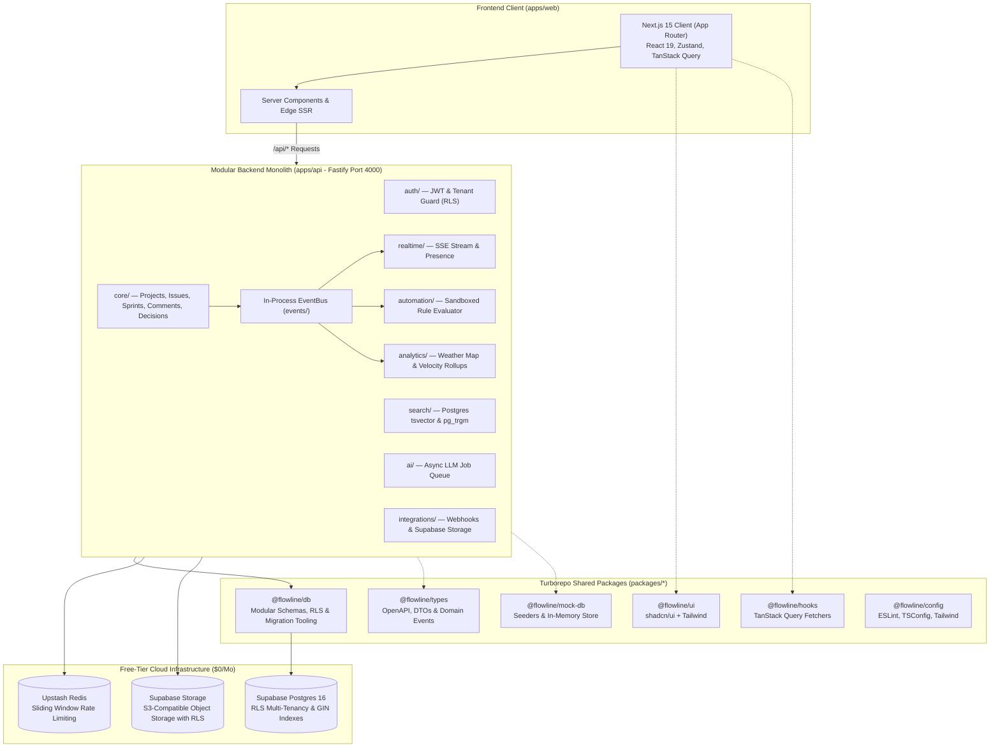

# Flowline — System Architecture Overview

This document provides a high-level overview of Flowline's end-to-end architecture, covering the Next.js frontend, the Modular Backend Monolith, data services, and Turborepo shared packages.

---

## Key System Tenets

1. **Modular Monolith with Migration Seams:**
   - Single deployable Fastify application divided into 8 bounded domain modules.
   - Decoupled in-process EventBus for asynchronous side effects without cross-module DB imports.
   - Read more in [Backend Architecture](file:///d:/INT%20OLD-20260720T064034Z-1-001/INT%20OLD/Playground/uniqueprojmang/docs/architecture/backend-architecture.md) and [ADR 0002](file:///d:/INT%20OLD-20260720T064034Z-1-001/INT%20OLD/Playground/uniqueprojmang/docs/adr/0002-modular-monolith-boundary.md).

2. **Pooled Multi-Tenancy with Row-Level Security (RLS):**
   - Mandatory `tenant_id` on all tables enforced by database-level PostgreSQL RLS policies (`FORCE ROW LEVEL SECURITY`).
   - Modular SQL migrations partitioned by domain in `@flowline/db` (`packages/db/schemas/`).
   - Read more in [ADR 0001](file:///d:/INT%20OLD-20260720T064034Z-1-001/INT%20OLD/Playground/uniqueprojmang/docs/adr/0001-tenancy-model.md).

3. **Scale-Ready Client Architecture (1M+ Users Target):**
   - Server Components by default (<150KB initial JS payload per route).
   - Cursor-based pagination and virtualized list rendering.
   - Read more in [Frontend Architecture](file:///d:/INT%20OLD-20260720T064034Z-1-001/INT%20OLD/Playground/uniqueprojmang/docs/architecture/frontend-architecture.md).

4. **Contract-First Development:**
   - OpenAPI 3.0 / Swagger UI hosted directly at `/docs`.
   - Read more in [OpenAPI Specs](file:///d:/INT%20OLD-20260720T064034Z-1-001/INT%20OLD/Playground/uniqueprojmang/docs/api/openapi-specs.md).
