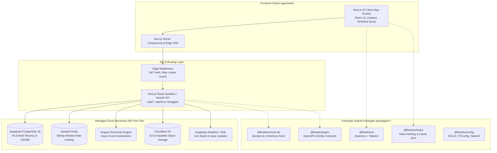

# Flowline — System Architecture Overview

This document provides a high-level overview of Flowline's end-to-end architecture, covering how the Next.js frontend, Route Handlers / API, database layer, and third-party managed serverless services integrate.

---

## Key System Tenets

1. **Scale-Ready Client Architecture (1M+ Users Target):**
   - Server Components by default to minimize client bundle size (<150KB per route).
   - Cursor-based pagination on all list endpoints.
   - Virtualized rendering for boards and backlogs via `@tanstack/react-virtual`.
   - Read more in [Frontend Architecture](file:///d:/INT%20OLD-20260720T064034Z-1-001/INT%20OLD/Playground/uniqueprojmang/docs/architecture/frontend-architecture.md).

2. **Zero-Cost Production Blueprint ($0/Month forever):**
   - Eliminates expensive 24/7 container clusters in the cloud.
   - Leverages Supabase (Postgres + RLS), Upstash (Redis via HTTP), Inngest (serverless jobs), and Cloudflare R2 ($0 egress storage).
   - Read more in [Backend Architecture](file:///d:/INT%20OLD-20260720T064034Z-1-001/INT%20OLD/Playground/uniqueprojmang/docs/architecture/backend-architecture.md).

3. **Contract-First Development:**
   - Swagger / OpenAPI specifications hosted directly at `/api/docs`.
   - Client TypeScript SDK generated automatically for strict type consistency.
   - Read more in [OpenAPI Specs](file:///d:/INT%20OLD-20260720T064034Z-1-001/INT%20OLD/Playground/uniqueprojmang/docs/api/openapi-specs.md).
