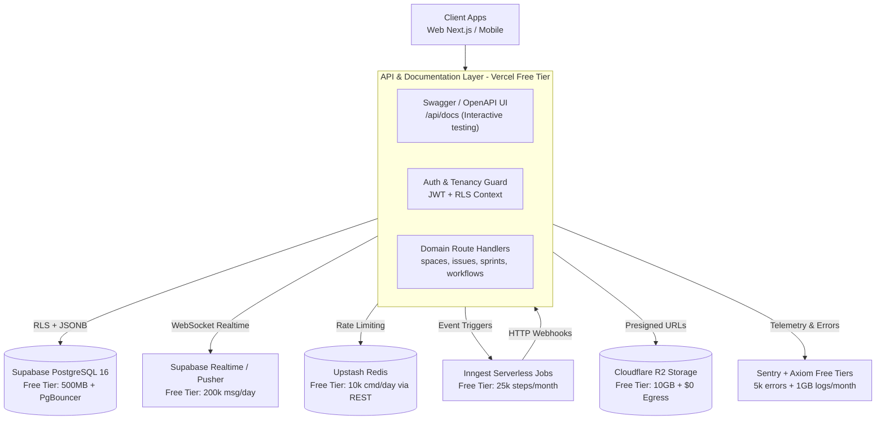

# Flowline Backend Architecture — Zero-Cost Review & Recommendations

> **Constraint & Principle:** This architecture is designed to run reliably for ~100 independent companies (tenants) on **100% free resources ($0/month forever)**. It completely eliminates expensive cloud Docker hosting and heavy self-hosted container clusters, replacing them with production-grade, generous forever-free cloud tiers and integrating **Swagger / OpenAPI** for interactive API documentation and testing.

---

## 1. The Cost Reality: Why Cloud Docker is Too Expensive

The previous architecture proposed running 4–7 persistent Docker containers in the cloud:
- NestJS API instance(s)
- BullMQ worker process (running 24/7)
- PostgreSQL 16 database
- Redis 7 instance
- MinIO object storage
- Prometheus + Grafana + Loki + OpenTelemetry observability cluster

### The Reality of "Free" Docker Hosting:
1. **Container Platforms (Render, Railway, Fly.io):**
   - Railway has completely eliminated its permanent free tier.
   - Render's free tier spins down web services after 15 minutes of inactivity (causing painful **50+ second cold starts**) and **forbids background worker processes** on the free tier.
   - Fly.io requires a credit card and charges for persistent storage volumes and public IPv4 addresses.
2. **Persistent Background Workers:**
   - BullMQ requires a persistent Node.js process running 24/7 to poll Redis. In serverless or free container tiers, persistent worker processes are either banned or charged at standard VPS rates ($7–$15/service/month).
3. **Self-Hosted Observability & MinIO:**
   - Running Grafana + Prometheus + Loki + MinIO requires at least 3–4 GB of RAM. The cheapest VPS capable of hosting this cluster reliably (e.g. DigitalOcean, Hetzner, AWS EC2) costs **$20–$40/month**.

**Conclusion:** Hosting multi-container Docker applications in production is **not free**. Docker should be relegated strictly to **optional offline local development** ($0 on your own machine), while the production architecture must leverage **managed serverless free tiers**.

---

## 2. The 100% Free-Tier Architecture Blueprint ($0/Month)



### Complete Free-Tier Stack Breakdown

| Component | Free Provider | Free-Tier Allowance | Why It Replaces Paid/Docker Options | Cost |
|---|---|---|---|---|
| **Database** | **Supabase** (or Neon.tech) | 500 MB Postgres 16, 2 active projects, Supavisor connection pooler | Full PostgreSQL with Row-Level Security (RLS), JSONB GIN indexes, and zero server maintenance. | **$0** |
| **API / Compute** | **Next.js 15 Route Handlers (Vercel)** | 100 GB bandwidth, unlimited serverless invocations within fair-use | Native integration with `apps/web`. Zero cold starts on Edge, no separate API server to host or pay for. | **$0** |
| **API Documentation** | **Swagger UI / OpenAPI 3.0** | Built-in via `@scalar/nextjs` or `next-swagger-doc` + `swagger-ui-react` | Hosted directly at `/api/docs`. Interactive request testing, JWT Bearer auth, zero external hosting. | **$0** |
| **Background Jobs** | **Inngest** (or Upstash QStash) | 25,000 steps/month, unlimited functions, 7-day log retention | **Serverless event-driven jobs**. Replaces 24/7 BullMQ worker containers; executes via HTTP webhooks. | **$0** |
| **Cache & Rate Limiting** | **Upstash Redis** | 10,000 commands/day, 256 MB storage, REST API access | Works over HTTP without exhausting DB/Redis TCP connection pools in serverless environments. | **$0** |
| **Object Storage** | **Cloudflare R2** | 10 GB storage, 10M read req, 1M write req, **zero egress fees** | Replaces MinIO. Zero server to run, S3-compatible API, no bandwidth bills. | **$0** |
| **Realtime Updates** | **Supabase Realtime** (or Pusher Sandbox) | 200 concurrent connections, 2M messages/month (or Pusher 200k/day) | Built-in WebSocket broadcasting and Postgres CDC. Replaces self-hosted SSE + Redis pub/sub. | **$0** |
| **Observability** | **Sentry + Axiom** | Sentry: 5k errors/mo; Axiom: 1 GB structured logs/mo | Replaces self-hosted Prometheus + Grafana + Loki (which required 4GB RAM). | **$0** |
| **Total Monthly Cost** | | | | **$0.00** |

---

## 3. Swagger & OpenAPI: First-Class API Contract & Testing

To ensure seamless frontend-backend development and external developer access without paid tooling, **Swagger / OpenAPI 3.0** is embedded directly into the application.

### 3.1 Interactive Swagger UI at `/api/docs`
- Accessible directly at `https://your-domain.com/api/docs` (or `http://localhost:3000/api/docs` locally).
- Powered by `swagger-ui-react` or modern alternative `@scalar/nextjs` (lightweight, zero runtime overhead).
- Exports OpenAPI 3.0 JSON specification at `/api/openapi.json`.

### 3.2 Key Swagger Capabilities
1. **Interactive Multi-Tenant Request Testing:**
   - Pre-configured with JWT Bearer Authentication (`Authorize` button).
   - Global or per-request header injection for `x-company-id` to test tenant isolation directly from the browser.
2. **Schema Validation & Documentation:**
   - Request and response DTOs documented with types, descriptions, examples, and status codes (`200 OK`, `201 Created`, `400 Bad Request`, `401 Unauthorized`, `403 Forbidden`, `429 Too Many Requests`).
   - Query parameter documentation for cursor pagination (`cursor`, `limit`).
3. **End-to-End TypeScript Client Generation ($0):**
   - Generate strict client-side TypeScript SDKs directly from `/api/openapi.json` using `openapi-typescript`:
     ```bash
     npx openapi-typescript http://localhost:3000/api/openapi.json -o packages/types/src/api-schema.ts
     ```
   - Guarantees that frontend hooks (`@flowline/hooks`) never fall out of sync with backend contracts.

---

## 4. Multi-Tenancy, Security & Background Processing (Free-Tier Adapted)

### 4.1 Row-Level Security (RLS) on Supabase Postgres
Every tenant-scoped table (`companies`, `spaces`, `sprints`, `issues`, `comments`, `custom_field_definitions`) enforces RLS:

```sql
-- 1. Enable RLS
ALTER TABLE issues ENABLE ROW LEVEL SECURITY;

-- 2. Tenant isolation policy using JWT company claim or session setting
CREATE POLICY tenant_isolation_policy ON issues
    AS RESTRICTIVE
    USING (company_id = NULLIF(current_setting('app.current_company_id', true), '')::uuid)
    WITH CHECK (company_id = NULLIF(current_setting('app.current_company_id', true), '')::uuid);
```

### 4.2 Per-Tenant Rate Limiting with Upstash Redis
Instead of maintaining a stateful Redis cluster, use Upstash's `@upstash/ratelimit` over HTTP:
- **Sliding Window Algorithm:** 100 requests per 10 seconds per `company_id`.
- Executed inside Next.js Edge Middleware or route guards before hitting the database.
- Completely protects against noisy-neighbor attacks at $0 cost.

### 4.3 Background Automations with Inngest (Zero-Container Workers)
Instead of a dedicated BullMQ worker container running 24/7:
1. When an issue status changes, the Route Handler emits an event to Inngest:
   ```ts
   await inngest.send({
     name: "issue/status.updated",
     data: { issueId, companyId, oldStatus, newStatus }
   });
   ```
2. Inngest's cloud dispatcher calls your secure webhook endpoint (`/api/inngest`) when jobs are ready to run.
3. Features out-of-the-box:
   - Automatic retries with exponential backoff.
   - Step-based workflows (e.g., wait 24 hours, check if SLA breached, send alert).
   - Rate limiting and concurrency throttling per company.
   - **Cost: $0 for up to 25,000 steps per month.**

---

## 5. Local Development vs. Production Strategy

| Environment | Strategy | Tools Used | Cost |
|---|---|---|---|
| **Production** | 100% Serverless Free Tiers | Vercel (Next.js) + Supabase (Postgres) + Upstash (Redis) + Cloudflare R2 + Inngest | **$0.00/mo** |
| **Staging / Preview** | Vercel Preview Deployments + Supabase Branching | Automatic per-PR preview URLs, ephemeral database branches | **$0.00/mo** |
| **Local Development** | **Option A (Zero Docker - Recommended):** Connect directly to free Supabase dev project / mock DB.<br/>**Option B (Offline Docker):** Run `docker-compose.yml` locally for offline Postgres/Redis. | Option A: `npm run dev`<br/>Option B: Docker Compose (local host only) | **$0.00/mo** |

> [!NOTE]
> `docker-compose.yml` is retained in the repository purely as an **optional local offline convenience**. It is **never deployed to the cloud**, eliminating all cloud container costs.

---

## 6. Verification Checklist

1. **Zero-Dollar Budget Guarantee:**
   - Every service must have a verified, permanent free tier without required paid conversions.
2. **Swagger Verification:**
   - Navigate to `/api/docs` in local dev and staging.
   - Test endpoints with JWT Bearer token authentication and verify request/response schemas.
3. **RLS Isolation Test:**
   - Attempt to query an issue belonging to `Company B` using an authenticated token for `Company A` — verify `404 Not Found` or empty dataset.
4. **Rate Limit Test:**
   - Trigger 150 burst requests from one tenant key and verify `429 Too Many Requests` is returned from Upstash rate limiter without affecting other tenants.
5. **Background Job Test:**
   - Trigger an automation rule and verify Inngest processes the step function via webhook without a persistent background container.
